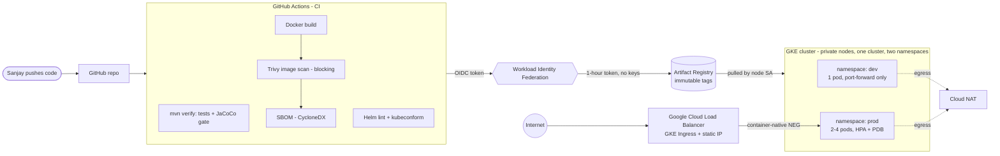
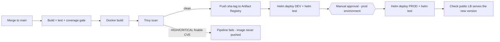

# Project 5 — Java (Spring Boot) App CI/CD on Google GKE

**Author: Sanjay Naidu** · Platform Engineering portfolio project

**ebayshopping** is a small e-commerce storefront (catalog, search, cart, checkout) that I ship through a full delivery pipeline to Google Kubernetes Engine. It's the GCP version of my Azure projects, and like them it runs on a free-trial budget. Projects 3 and 4 used AKS. This one runs the same ideas on Google Cloud: keyless OIDC from GitHub, gated promotion from dev to prod, and a scan before any image gets pushed. The cloud differences in how those ideas work turned out to be the interesting part.

```
Java 21 · Spring Boot 4 · Maven · Docker (distroless) · GitHub Actions (OIDC / Workload Identity Federation)
Trivy · Artifact Registry · GKE · GKE Ingress (Google Cloud Load Balancer) · Helm 4 · SonarCloud (optional)
```


---

## Architecture



**Pipeline flow on every merge to `main`:**



---

## Why each decision (the part interviewers ask about)

### Application

| Decision | Why |
|---|---|
| **Spring Boot 4 on Java 21** | Current Spring generation on an LTS JDK. Actuator gives Kubernetes-grade health probes and Prometheus metrics without extra code. |
| **Server-rendered pages + REST API** | Thymeleaf pages for the shop, and a JSON API (`/api/products`, `/api/orders`) that the cart and checkout use. One deployable, no separate frontend build. |
| **Cart stored in the browser, pods stateless** | No sticky sessions and no session store. The HPA can add or kill any replica and nobody loses their cart. |
| **Server re-prices every order** | The client only sends product IDs and quantities. Prices and stock always come from the catalog, because the browser can be edited. |
| **`/livez` + `/readyz` on the app port, Actuator on port 8081** | Probes check the port that actually serves traffic. `/actuator/prometheus` sits on a port that the Service and Ingress never expose, so metrics can't be reached from the internet. An integration test proves it. |
| **`/api/info` + footer show version, env and pod** | After a deploy I can *prove* which build is running where. The pipeline uses this to verify prod. |
| **Graceful shutdown + virtual threads** | In-flight requests finish during rollouts. Virtual threads give more concurrency on a small pod. |
| **In-memory catalog (no database)** | A deliberate scope decision: this project is about the delivery platform. Cloud SQL is the first roadmap item. |

### Containerisation

| Decision | Why |
|---|---|
| **Multi-stage build** | Maven, the JDK and the source never ship. Only the JRE and the app layers do. |
| **Distroless `java21-debian13:nonroot`** | No shell, no package manager, no curl. Far fewer OS packages for Trivy to flag, and nothing for an attacker to use. |
| **Spring Boot layered jar** | The dependencies layer rarely changes, so a code change pushes a few KB instead of the whole image. |
| **`MaxRAMPercentage=75` + `ExitOnOutOfMemoryError`** | Heap is sized from the pod's memory limit. On OOM the JVM crashes fast and Kubernetes restarts it, instead of a half-dead JVM serving errors. |

### Infrastructure (GKE)

| Decision | Why |
|---|---|
| **Scripted with `gcloud` (idempotent), not Terraform** | Project 3 used Terraform. Here I wanted to learn the raw GCP primitives first. Every step checks whether the resource exists, so a half-failed run is fixed by re-running. Terraform is on the roadmap. |
| **Zonal Standard cluster** | GKE's free tier covers the $0.10/h management fee for **one zonal** cluster, so the control plane costs $0. A regional cluster would triple the nodes. |
| **`e2-medium` nodes, autoscaler 1→3, `optimize-utilization`** | Cheapest general-purpose shape that fits the JVM plus GKE system pods. 3 × 2 vCPU stays under the free trial's 8 vCPU cap, even during a surge upgrade. |
| **`pd-standard` 30 GB boot disks** | Default is 100 GB SSD-backed. HDD is cheaper and avoids the trial's SSD quota. |
| **Private nodes + Cloud NAT** | Nodes have no public IPs, so nothing can reach them directly. NAT provides outbound traffic only. It costs about the same as giving each node a public IP. |
| **Custom VPC with pod/service secondary ranges** | VPC-native networking, which container-native load balancing needs. An explicit IP plan, and teardown deletes exactly what was created. |
| **Dataplane V2** | eBPF networking with NetworkPolicy enforcement built in, at no extra cost. |
| **Dedicated node service account** | The default Compute SA has Editor. My node SA only gets `container.defaultNodeServiceAccount` + `artifactregistry.reader` on one repo. |
| **Workload Identity pool enabled** | Free at create time. Pods can later call GCP APIs as a service account without keys. |
| **System-only logging/monitoring** | Stays inside the free Cloud Logging allotment. Application logs via `kubectl logs` + `/actuator/prometheus` are enough for a demo. |

### Ingress controller

| Decision | Why |
|---|---|
| **GKE's built-in ingress controller (`gce`)** | Google runs it, so there's nothing for me to install, patch or scale. It builds a global external Application Load Balancer. It's the GKE counterpart of the AKS managed nginx add-on I used in Project 3. Community ingress-nginx is also retired now, so building on it would be the wrong call. |
| **Container-native load balancing (NEGs)** | The LB sends traffic straight to pod IPs. No NodePort hop, and pod readiness gates make rollouts wait for the *load balancer* to see a pod as healthy, not only Kubernetes. |
| **BackendConfig → `/readyz` health check** | The LB health check and Kubernetes readiness agree on exactly when a pod can take traffic. 30s connection draining on removal. |
| **Reserved global static IP** | The public address survives redeploys and teardown/re-create of the app. |
| **Only prod gets an ingress** | Each GKE Ingress creates its own load balancer (~$18/month). Dev is reached with `kubectl port-forward`. |

### CI/CD (GitHub Actions)

| Decision | Why |
|---|---|
| **Workload Identity Federation (OIDC)** | Zero long-lived credentials. No service account JSON key exists anywhere. See [docs/GITHUB-OIDC-TO-GCP.md](docs/GITHUB-OIDC-TO-GCP.md). |
| **Trust bound to repo *and* owner ID** | The provider's attribute condition checks `repository` and the numeric `repository_owner_id`. If my account were ever renamed, someone who registered the old name could not deploy. |
| **Least-privilege deployer SA** | `artifactregistry.writer` on one repo + `container.developer`. It cannot create VMs, change IAM or delete the cluster. |
| **Actions pinned to commit SHAs** | Tags can be moved by whoever controls the action's repo, and a SHA can't. The `tj-actions/changed-files` compromise (March 2025) rewrote tags to leak CI secrets, and SHA-pinned workflows were unaffected. Dependabot bumps the SHAs. |
| **Trivy scans *before* push** | A vulnerable image never reaches the registry. HIGH/CRITICAL with a fix available = build fails. |
| **SBOM (CycloneDX) per build** | When the next Log4Shell lands, "are we affected?" becomes a search instead of an investigation. |
| **Immutable `sha-<commit>` tags, enforced twice** | Artifact Registry rejects overwriting a tag, and the Helm chart `fail`s on an empty or `latest` tag. |
| **Reusable quality workflow** | PR checks and the deploy pipeline share one definition, so they can't drift apart. |
| **JaCoCo 70% gate in `mvn verify`; SonarCloud optional** | The coverage gate works without any external service. Setting `SONAR_ENABLED=true` adds SonarCloud with a blocking quality gate. |
| **Helm 4 `--rollback-on-failure`** | A release that doesn't become healthy rolls back automatically. |
| **`helm test` + public LB check** | *Healthy in-cluster* and *reachable from the internet* are different claims. The prod job checks both, and fails unless the public URL serves the exact tag that was just deployed. |
| **GitHub Environments + required reviewer** | Prod pauses for approval. The *same image* verified in dev is promoted, with no rebuild. |
| **Decommission-safe pipeline** | With `GCP_PROJECT_ID` unset, CI still builds and scans but skips push/deploy, so the badge stays green after teardown. |

### Helm chart (production traits)

- Per-environment values (`values-dev.yaml` / `values-prod.yaml`) over one base. The pipeline injects only the image repo and tag.
- **Zero-downtime rollouts**: `maxUnavailable: 0`, startup probe for JVM boot, a native `preStop` sleep (distroless has no shell), graceful shutdown, and LB connection draining. Budget: 15s + 20s < 60s grace period.
- **HPA** (prod 2→4 on CPU, with a scale-up stabilisation window so JVM startup isn't mistaken for load) and a **PodDisruptionBudget** (GKE auto-upgrades drain nodes).
- **Topology spread** across nodes in prod.
- **Memory limit, no CPU limit.** CFS throttling turns JVM startup into minutes. Memory is incompressible, so it's always capped.
- **Hardened pods**: non-root UID 65532, read-only root FS, all capabilities dropped, seccomp `RuntimeDefault`, and no ServiceAccount token mounted.
- Optional **NetworkPolicy** that allows Google's LB/health-check ranges (`35.191.0.0/16`, `130.211.0.0/22`). Forgetting those is the classic way to take a GKE site down while every pod looks healthy.

---

## Monthly cost picture (why this fits a free trial)

Approximate `us-central1` list prices, running 24×7:

| Resource | Config | ~Cost/month |
|---|---|---|
| GKE control plane | 1 zonal cluster | $0 (free tier credit) |
| Nodes | 2 × e2-medium | ~$49 |
| Boot disks | 2 × 30 GB pd-standard | ~$2.40 |
| Ingress load balancer | 1 forwarding rule + data | ~$18 |
| Static IP | global, attached | ~$3 |
| Cloud NAT | gateway + 1 NAT IP | ~$5 |
| Artifact Registry | < 0.5 GB with cleanup policy | $0 |
| Logging / Monitoring | system components only | $0 (free allotment) |
| GitHub Actions / Trivy / SonarCloud | public repo | $0 |
| **Total** | | **~$80/month ≈ $2.60/day** |

The free trial gives $300 for 90 days. **A free-trial account is never charged:** when the credit or the 90 days run out, resources stop unless you manually upgrade to a paid account.

Cost levers built in:

- `bash scripts/gke-pause.sh pause` scales nodes to 0 between demos (saves ~$1.60/day; the LB and NAT keep running). `resume` brings everything back in ~3 minutes.
- `bash scripts/gcp-decommission.sh` deletes everything in the right order (see below). Re-creating takes ~15 minutes.
- Artifact Registry cleanup policy: keep the last 10 images.

---

## Repository layout

```
├── app/                        # Spring Boot service (Maven)
│   ├── src/main/java/...       #   catalog / order / api / web packages
│   ├── src/main/resources/     #   application.yml, Thymeleaf templates, css/js
│   └── src/test/java/...       #   unit tests + full-HTTP integration test
├── Dockerfile                  # Multi-stage, layered jar, distroless non-root
├── helm/ebayshopping/          # Chart + values-dev / values-prod (GKE Ingress, BackendConfig, HPA, PDB)
├── scripts/
│   ├── config.sh               # every resource name, in one place
│   ├── gcp-setup.sh            # idempotent platform bootstrap (Cloud Shell)
│   ├── gke-pause.sh            # scale nodes to zero / back
│   └── gcp-decommission.sh     # ordered teardown
├── .github/workflows/          # pr-validation, build-and-deploy, reusable-quality
└── docs/
    ├── SETUP.md                # step-by-step: GCP project -> live URL -> teardown
    └── GITHUB-OIDC-TO-GCP.md   # how keyless GitHub -> GCP auth works (vs Azure)
```

---

## Getting started

The full walkthrough is in **[docs/SETUP.md](docs/SETUP.md)**: GCP project, Cloud Shell, the setup script, GitHub variables and environments, first deploy, and teardown. Nothing needs to be installed locally. Builds run on GitHub, and GCP commands run in Cloud Shell.

Run locally (optional, needs JDK 21 + Maven 3.9):

```bash
cd app
mvn spring-boot:run          # http://localhost:8080  (actuator on :8081)
mvn verify                   # tests + coverage gate
```

---

## Decommission

```bash
bash scripts/gcp-decommission.sh
```

The order matters, and the script handles it. The load balancer and its NEGs are created by the GKE ingress controller, not by me. If the cluster is deleted first, the controller disappears before it can clean them up: the LB keeps billing and orphaned NEGs block the VPC delete. So the script uninstalls the apps, waits for the LB to be gone, and only then deletes the cluster, network, registry and identities. At the end it lists anything billable that is still left.

---

## Production-hardening roadmap (what I'd add with a real budget)

1. **Cloud SQL (PostgreSQL) + Spring Data JPA**, connected through the Cloud SQL Auth Proxy with Workload Identity: real persistence for orders and stock.
2. **HTTPS**: a domain + Google-managed certificate (`ManagedCertificate`) and an HTTP→HTTPS redirect via `FrontendConfig`.
3. **Cloud Armor** on the load balancer: WAF rules and rate limiting.
4. **Terraform** for everything in `gcp-setup.sh`, with remote state in a GCS bucket.
5. **Gateway API** (`gke-l7-global-external-managed`), the successor to Ingress on GKE.
6. **Google Cloud Managed Service for Prometheus** (`PodMonitoring` on port 8081) + dashboards and SLO alerts.
7. **Binary Authorization**: only images signed by this pipeline may run in prod.
8. **Separate projects per environment** and a private control plane endpoint, reached from self-hosted runners.
9. **GitOps (Argo CD)**: pull-based deploys, with git as the single source of truth.

---

*Built by **Sanjay Naidu**, platform engineer. Every file in this repo carries an author header, and I can defend every decision above on a whiteboard.*

<sub>"ebayshopping" is a portfolio demo name. This project is not affiliated with, endorsed by, or connected to eBay Inc.</sub>
