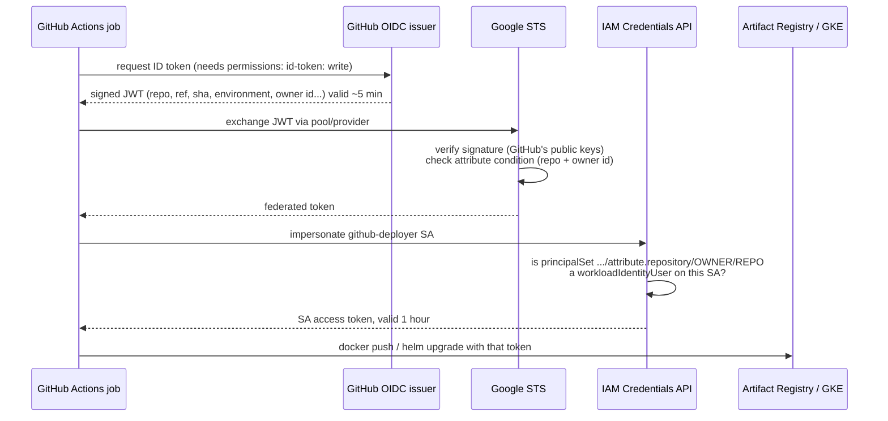

# How GitHub Actions logs in to Google Cloud without a key

**Author: Sanjay Naidu**

I wrote this note while wiring Project 5. I knew the Azure version of this (federated credentials on an Entra ID app registration) and wanted the GCP equivalent clear in my head before relying on it.

---

## The problem

A pipeline has to push images and deploy to the cluster, so it needs Google credentials. The old way is to create a service account **JSON key**, paste it into a GitHub secret, and hope it never leaks. The key never expires by itself, works from anywhere, and ends up copied into laptops and CI logs.

**Workload Identity Federation (WIF)** removes the key entirely.

## The flow, step by step



`google-github-actions/auth` does all of this in one step. After it runs, `gcloud`, `docker` and `kubectl` in the job are logged in.

## The four GCP objects involved

| Object | Created by | What it is |
|---|---|---|
| **Workload identity pool** `github-pool` | `gcp-setup.sh` step 8 | A container for external identities. It sits alongside Google accounts and service accounts. |
| **OIDC provider** `github-oidc` | step 8 | "Trust tokens signed by `https://token.actions.githubusercontent.com`", plus an **attribute mapping** and an **attribute condition**. |
| **Service account** `github-deployer` | step 7 | The identity the job becomes. Its roles define what CI can do. |
| **IAM binding** `roles/iam.workloadIdentityUser` | step 8 | "Identities from repo X may impersonate this service account." |

### Attribute mapping: turning JWT claims into Google attributes

```
google.subject                 = assertion.sub                  (e.g. repo:Sanjay-Naidu/project5-...:environment:prod)
attribute.repository           = assertion.repository           (Sanjay-Naidu/project5-java-cicd-trivy-gke-helm)
attribute.repository_owner_id  = assertion.repository_owner_id  (numeric, never changes)
attribute.ref                  = assertion.ref                  (refs/heads/main)
```

### Attribute condition: the gate

```
assertion.repository == 'Sanjay-Naidu/project5-java-cicd-trivy-gke-helm'
  && assertion.repository_owner_id == '<my numeric GitHub id>'
```

Tokens from any other repository are rejected at the STS step, before any service account is involved. The owner-id check covers one edge case: if I renamed my GitHub account and someone else registered `Sanjay-Naidu`, the repository name would match but the numeric id wouldn't.

## Coming from Azure: what's different

| | Azure (Projects 3 and 4) | GCP (this project) |
|---|---|---|
| Trust object | Federated credential on an Entra ID **app registration** | **Workload identity pool + OIDC provider** |
| What gets matched | The exact `subject` string, one credential per subject | A **CEL expression** over any claim |
| Branch vs PR vs environment | A separate federated credential for each (`ref:refs/heads/main`, `pull_request`, `environment:prod`...). Adding `environment:` to a job changes the subject, and a missing credential gives `AADSTS700213` | One condition on `repository` covers every job in the repo. Environments don't need extra setup. |
| Identity used | The app's service principal | A service account, impersonated |
| Permissions | Azure RBAC role assignments | IAM roles on the SA (project- or resource-level) |
| Workflow step | `azure/login` with client-id / tenant-id / subscription-id | `google-github-actions/auth` with `workload_identity_provider` + `service_account` |

On Azure I hit the subject-matching problem directly. GitHub started sending immutable-id subjects (`repo:Owner@123/repo@456:...`), which didn't match the credentials I had created. Because the GCP condition matches on the `repository` claim and not the subject, that class of problem doesn't apply here.

## Hardening options (not needed for a demo, good to know)

- **Split dev/prod identities.** Create two deployer SAs and bind prod's `workloadIdentityUser` to `principalSet://.../attribute.environment/prod` (after mapping `attribute.environment=assertion.environment`). Then only jobs running in the approval-gated `prod` environment can touch prod.
- **Restrict to `main`.** Add `&& assertion.ref == 'refs/heads/main'` to the condition, so a feature-branch workflow can never get a token.
- **Direct resource access (no SA).** Grant roles straight to the `principalSet`, which skips impersonation. It's simpler, but not every Google API supports federated principals yet, so I kept the service account.

## Verifying it in the GCP console

- *IAM & Admin → Workload Identity Federation → github-pool*: the provider and its condition.
- *IAM & Admin → Service Accounts → github-deployer → Principals with access*: the `principalSet` binding.
- *Logging → Logs Explorer*, query `protoPayload.serviceName="sts.googleapis.com"`: every token exchange, with the repository that asked. This needs Data Access audit logs turned on for *Security Token Service API* (IAM & Admin → Audit Logs), since they're off by default.
